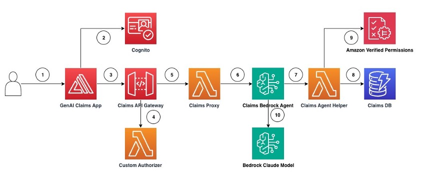

# Designing secure generative AI Application workflows with Amazon Verified Permissions and Agents for Bedrock

[Link AWS Blog: https://aws.amazon.com/blogs/aws/](https://aws.amazon.com/blogs/aws/)

This is sample code we will demonstrate how to design fine-grained access controls using Verified Permissions for a generative AI application that uses agents for Bedrock to answer questions about insurance claims that exist in a claims review system using textual prompts as inputs and outputs.


# **Architecture presented in this Repo:**


The architecture and flow of the sample application will be:



The application architecture flow is as follows:

1. User accesses the Generative AI Claims web application (App)
2. The App authenticates the user with the Amazon Cognito service and issues an ID Token and an Access Token. The ID token has the user's identity and custom attributes.
3. Using the App, the user sends a request asking the application to "list the open claims". The request is sent along with the user's ID Token and Access Token. The App calls the Claims API Gateway API to execute the Claims proxy passing user request and tokens.
4. Claims API Gateway runs the Custom Authorizer to validate the access token
5. When access token validation is successful, the Claims API Gateway sends the user request to the Claims Proxy
6. The Claims Proxy invokes the Bedrock Agent passing the user request and ID token. Bedrock agent is configured to use the Anthropic Claude model and to execute actions using the Claims Agent Helper Lambda function
7. Bedrock Agent leverages chain-of-thought-prompting and builds the list of API actions to execute with the help of Claims Agent Helper
8. The Claims Agent Helper retrieves Claim records from Claims DB and constructs claims list object
9. The Claims Agent Helper retrieves user's metadata(i.e. name, sub ) from ID token, builds the Verified Permissions data entities and makes the Verified Permissions authorization request. This request contains the principal (user/role), action (i.e. ListClaim) and resource (Claim). Verified Permissions evaluates the request against all Verified Permissions policies and return Allow or Deny decision. Subsequently, the Claims Agent Helper filters the claims based on that decision. Note that Verified Permissions has 'default deny' functionality; in the absence of an explicit allow, the service defaults to an implicit deny. If there is an explicit Deny in any of the policies involved in the request, Verified Permissions denies the request
10. The Claims Bedrock Agent receives the authorized list of claims, augments the prompt and sends it to Claude model for completion. The Agent returns the completion back to the caller.
# How to use this Repo:

## Prerequisites:

1. Amazon Bedrock Access and AWS CLI Credentials.
2. Ensure that AWS CLI is installed on your machine. It can be downloaded [here](https://aws.amazon.com/cli/)
3. Ensure Python 3.9+ installed on your machine, it is the most stable version of Python for the packages we will be using, it can be downloaded [here](https://www.python.org/downloads/release/python-3911/).

## Step 1:

The first step of utilizing this repo is performing a git clone of the repository.

```
git clone git@github.com:aws-samples/bedrock-agents-security.git
```

After cloning the repo onto your local machine, open it up in your favorite code editor. The file structure of this repo is broken into 3 key files,
the app.py file, the llm_multi_modal_invoke.py file, and the requirements.txt. The app.py file houses the frontend application (a streamlit app).
The llm_multi_modal_invoke.py file houses the logic of the application, including the image encoding and Amazon Bedrock API invocations.
The requirements.txt file contains all necessary dependencies for this sample application to work.

## Step 2:

Managing CLI parameters as Environment Variables.
Start with setting a default region. This code was tested in us-east-1.

```
aws configure set default.region us-east-1

```
## Step 3:

The below step will use AWS SAM (Serverless Application Model) to create the following resources as Nested Stacks: 
1. Amazon Verified Permissions Policy Store and Policies
2. Cognito User Pool
3. Amazon Bedrock Agent
4. Amazon API Gateway
5. Cloud 9 Environment

Please ensure that your AWS CLI Profile has access to run CloudFormation and create resources!

```
$ sam deploy --guided

```
The sam deployment will show progress of the deployment as follows:
```
sam deploy --guided

Configuring SAM deploy
======================

        Looking for config file [samconfig.toml] :  Not found

        Setting default arguments for 'sam deploy'
        =========================================
        Stack Name [sam-app]: claims-app
        AWS Region [us-east-1]: 
        #Shows you resources changes to be deployed and require a 'Y' to initiate deploy
        Confirm changes before deploy [y/N]: 
        #SAM needs permission to be able to create roles to connect to the resources in your template
        Allow SAM CLI IAM role creation [Y/n]: 
        #Preserves the state of previously provisioned resources when an operation fails
        Disable rollback [y/N]: 
        Save arguments to configuration file [Y/n]: 
        SAM configuration file [samconfig.toml]: 
        SAM configuration environment [default]: 

        Looking for resources needed for deployment:

        Managed S3 bucket: aws-sam-cli-managed-default-samclisourcebucket-xxxxxxxxx
        A different default S3 bucket can be set in samconfig.toml and auto resolution of buckets turned off by setting resolve_s3=False

        Saved arguments to config file
        Running 'sam deploy' for future deployments will use the parameters saved above.
        The above parameters can be changed by modifying samconfig.toml
        Learn more about samconfig.toml syntax at 
        https://docs.aws.amazon.com/serverless-application-model/latest/developerguide/serverless-sam-cli-config.html

        Uploading to claims-app/f5495773ff2b15ce438e0aeeac0d3c5c.template  6475 / 6475  (100.00%)
        Uploading to claims-app/cfab1db38a90b3ff649827396273221f.template  2803 / 2803  (100.00%)
        Uploading to claims-app/89351551146be4ab2e3e1e91579e98e3  4834 / 4834  (100.00%)
        Uploading to claims-app/20a6c83459bb299c1eb8757797232ddb.template  7787 / 7787  (100.00%)
        Uploading to claims-app/14694d2c7ba4e7ec1c332ec246abb600  913 / 913  (100.00%)
        Uploading to claims-app/183087561a9f6c92b07a5b7459c82977.template  4507 / 4507  (100.00%)
        Uploading to claims-app/75cb10b10abd73ffebc060f16cfe2680.template  2919 / 2919  (100.00%)

        Deploying with following values
        ===============================
        Stack name                   : claims-app
        Region                       : us-east-1
        Confirm changeset            : False
        Disable rollback             : False
        Deployment s3 bucket         : aws-sam-cli-managed-default-samclisourcebucket-xxxxxx
        Capabilities                 : ["CAPABILITY_IAM"]
        Parameter overrides          : {}
        Signing Profiles             : {}

Initiating deployment
=====================

        Uploading to claims-app/56e42262ae2a7cbdad105747889d2ef5.template  2208 / 2208  (100.00%)


Waiting for changeset to be created..

CloudFormation stack changeset
---------------------------------------------------------------------------------------------------------------------------------------------------------------------------------------------------------------------------------------------
Operation                                                   LogicalResourceId                                           ResourceType                                                Replacement                                               
---------------------------------------------------------------------------------------------------------------------------------------------------------------------------------------------------------------------------------------------
+ Add                                                       AmazonVerifiedPermissions                                   AWS::CloudFormation::Stack                                  N/A                                                       
+ Add                                                       ApiGatewayStack                                             AWS::CloudFormation::Stack                                  N/A                                                       
+ Add                                                       BedrockAgentStack                                           AWS::CloudFormation::Stack                                  N/A                                                       
+ Add                                                       Cloud9Stack                                                 AWS::CloudFormation::Stack                                  N/A                                                       
+ Add                                                       CognitoUserPool                                             AWS::CloudFormation::Stack                                  N/A                                                       
---------------------------------------------------------------------------------------------------------------------------------------------------------------------------------------------------------------------------------------------


Changeset created successfully. 

2024-04-18 19:17:16 - Waiting for stack create/update to complete

CloudFormation events from stack operations (refresh every 5.0 seconds)
---------------------------------------------------------------------------------------------------------------------------------------------------------------------------------------------------------------------------------------------
ResourceStatus                                              ResourceType                                                LogicalResourceId                                           ResourceStatusReason                                      
---------------------------------------------------------------------------------------------------------------------------------------------------------------------------------------------------------------------------------------------
CREATE_IN_PROGRESS                                          AWS::CloudFormation::Stack                                  claims-app                                                  User Initiated                                            
CREATE_IN_PROGRESS                                          AWS::CloudFormation::Stack                                  AmazonVerifiedPermissions                                   -                                                         
CREATE_IN_PROGRESS                                          AWS::CloudFormation::Stack                                  CognitoUserPool                                             -                                                         
CREATE_IN_PROGRESS                                          AWS::CloudFormation::Stack                                  Cloud9Stack                                                 -                                                         
CREATE_IN_PROGRESS                                          AWS::CloudFormation::Stack                                  CognitoUserPool                                             Resource creation Initiated                               
CREATE_IN_PROGRESS                                          AWS::CloudFormation::Stack                                  Cloud9Stack                                                 Resource creation Initiated                               
CREATE_IN_PROGRESS                                          AWS::CloudFormation::Stack                                  AmazonVerifiedPermissions                                   Resource creation Initiated       
```

## Step 4:

After Step 3 is done, you can head over to the Cloud9 environment. This is where you will be running the front end code.  Once Cloud9 environment starts, this github repo will be cloned. 

## Step 5:

Run the below command to change to the frontend directory. Then run the following command to start the application.

```
cd bedrock-agents-security/006_Frontend

npm start 
```


## Step 6:

Create the users in Amazon Cognito as follows: 

```

```

## Step 7:

As soon as the application is up and running in your browser of choice you can begin asking questions in textbox like using natural language questions like :
1. list all claims
2. get claim details for claim 101
3. update claim details for claim 101